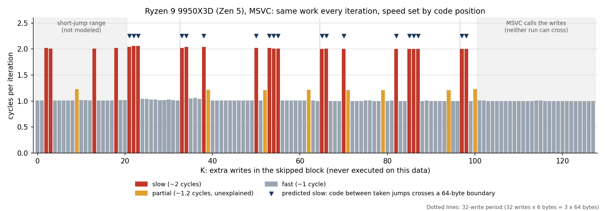

# Prelude

The path: after reading the blog post below, we set out to see whether taken
branches were really as costly as it showed. That meant many tests, ending with
this program. Along the way we tested data alignment, predication, variable
width, likely/unlikely hints, and a few other odd things.

In some ways we were lucky to find cases where the anomaly happens. But as the
final test shows, it is quite regular: if a critical loop happens to straddle one
of these boundaries in the wrong place, you pay a one-cycle toll per iteration.

Should you be worried? Mostly no. It only matters in tiny, hot loops where
fetching instructions is the bottleneck; in larger code, other costs usually
dominate. And unless you go looking for it, you will probably never notice it.

Antonio Badia's "More than a taken branch per cycle?" may have been partly
unlucky: its Zen 5 result could depend on where the compiler placed the loop.
In our sweep, roughly 1 in 5 or 6 placements hit the penalty. They researched
it, I followed, and I hope smarter people and AIs will follow.

Claude deserves a fair amount of credit. I drove the tests and proposed the
memory tests and control cases that ruled out other factors. Claude added
padding to test jump distance, spotted the 64-byte boundaries in the
disassembly, and my type-width and rebuild experiments proved it was position,
not code. When we designed the final test, Claude wanted a complicated
generate-machine-code-in-memory test; I said expand the sweep and map the
positions first, and that found the pattern. Then GCC kept reshaping the loop,
so look who got their fancy-pantsy inline assembly into the code anyway. Eh,
they earned it. Not that I can't write assembly.

# straddle

Maps a loop-alignment penalty on modern CPUs: when the code between two taken jumps
straddles a 64-byte boundary.

Does a loop's speed depend on where its code lands in memory? On AMD Zen 5, for this
loop, the answer turned out to be yes, and predictably so:

> **When a straight run of code between two taken jumps crosses a 64-byte boundary,
> the loop takes an extra cycle per iteration.**

In this loop the runs are the top (load, compare, jump over the skipped block) and the
bottom (from where that jump lands, through the increment and compare, to the end of
the jump back). On a Ryzen 9 9950X3D (MSVC build), this rule predicted all 19 slow cases
from K = 21 to 127 in a 128-step sweep, with no false predictions, using positions taken
from the disassembly. (Below K = 21 the jump over the writes uses a shorter encoding and
the positions weren't worked out.) This program lets you check it on your own CPU.



The slow cases repeat every 32 writes: each write is 6 bytes, and 32 × 6 = 192 bytes is
exactly three 64-byte blocks, so the bottom of the loop returns to the same position.
Raw data, with the prediction for each row: `results/zen5_9950x3d_msvc.csv`.

## Background

The loop comes from the post
[More than a taken branch per cycle?](https://lemire.me/blog/2026/09/21/more-than-a-taken-branch-per-cycle/)
on Daniel Lemire's blog: load a byte, compare it with a threshold, write it if larger.
Every value here is below the threshold, so the write never runs, and each iteration
takes two jumps: one over the skipped write, and one back to the top of the loop.

Earlier tests showed that the same loop ran at 1 or 2 cycles per iteration on Zen 5
depending on unrelated changes to the program: a rebuild, a type change, an edit
elsewhere in the file. The cause was the loop's position relative to 64-byte
boundaries. This sweep measures that directly.

## What it does

It builds the loop many times, each with a larger skipped block between the jump over
the write and the bottom of the loop. The skipped block never executes, so every
version does identical work per iteration. Only the position of the loop's bottom
changes. Then it times each version.

- **asm mode** (GCC or Clang on x86-64 or ARM64): the loop is written in inline
  assembly so the compiler cannot reshape it, the skipped block is a byte count, and
  the program reads back the exact address of each part of the loop. Each row reports
  whether either run of code crosses a 64-byte boundary.
- **C++ mode** (MSVC, other CPUs, or `-DSTRADDLE_FORCE_CXX=ON`): the skipped block is
  K `volatile` writes. The compiler decides the layout, so check the disassembly (see
  below). GCC reshapes this loop from about K = 16 on, which is why GCC and Clang
  default to asm mode.

## Build and run

With CMake (any platform):

```
cmake -B build
cmake --build build --config Release
```

Then run `build/straddle` (Linux, macOS) or `build\Release\straddle.exe`
(Visual Studio), saving the output:

```
build/straddle > results.csv
```

Without CMake:

```
g++ -O2 -std=c++20 straddle.cpp -o straddle        # Linux, or clang++ on macOS
cl /O2 /std:c++20 /EHsc straddle.cpp                # MSVC developer prompt
```

Visual Studio users: build **Release x64**. Debug builds measure something unrelated.

The full sweep takes a few seconds to a minute depending on the CPU. Keep other heavy
programs closed while it runs.

## Reading the output

The CSV has one row per loop version:

| Column | Meaning |
|---|---|
| `gap_bytes` or `K_writes` | Size of the skipped block (bytes in asm mode, writes in C++ mode) |
| `fn_mod64` | Where the function starts within its 64-byte block |
| `top64`, `top_len` | Where the top run starts within its 64-byte block, and its length (asm mode) |
| `land64`, `bottom_len` | Where the bottom run starts (the miss jump's landing point), and its length (asm mode) |
| `crosses64` | `1` if either run crosses a 64-byte boundary: the predicted-slow case (asm mode) |
| `ns_per_iter` | Time per loop iteration |
| `cycles` | Time relative to the fastest row, which runs at about 1 cycle per iteration |

The summary on stderr counts slow rows (over 1.5 cycles) and, in asm mode, how many
crossing rows were slow and how many slow rows had no crossing.

Chart `cycles` against the first column. On Zen 5, expect slow rows exactly where
`crosses64` is `1`. Other CPUs may show a different map, and that is the interesting
part: an Intel Xeon test machine was slow on every crossing row too, but also on others.
Please post what yours shows, with your CPU model and compiler.

## Options

| CMake option | Effect |
|---|---|
| `-DSTRADDLE_START=N` | Adds N bytes before the loop, moving all of it (asm mode). ARM64: multiple of 4. |
| `-DSTRADDLE_FORCE_CXX=ON` | Use the C++ loop even where assembly is available. |
| `-DSTRADDLE_ALIGN_LOOPS=64` | GCC/Clang in C++ mode: align loop starts, for comparison. |

Without CMake, pass the same names with `-D` to the compiler, for example
`g++ -O2 -std=c++20 -DSTRADDLE_START=16 straddle.cpp -o straddle`.

## Checking the disassembly (C++ mode)

- Linux: `objdump -d --no-show-raw-insn -C build/straddle | less`, search for `kernel<40>`
- macOS: `otool -tvV build/straddle | less`
- Visual Studio: break at the end of `main`, open Debug > Windows > Disassembly, and
  type `kernel<40>` into the Address box.

In each version, the conditional jump right after the compare must go **forward** over
the writes, and a separate jump at the bottom must go back to the top. A version that
looks different measures a different loop. MSVC may also stop inlining the writes for
large K and call a function instead; that version is also a different loop.

## Caveats

- **The `cycles` column is relative.** It assumes the fastest row is 1 cycle per
  iteration, which holds on the CPUs tested because each iteration waits on the
  previous `i++`. For true cycle counts use `perf stat -e cycles` on Linux or AMD uProf
  on Windows.
- **Tested:** x86-64 asm and C++ modes (GCC 13, Linux) and C++ mode (MSVC, Zen 3 and
  Zen 5). **Not yet tested:** the ARM64 path and the CMake file. Reports welcome.
- **Apple Silicon** uses 128-byte cache lines, so the 64-byte columns may not be the
  right measure there. The loop is aligned to 128 bytes in asm mode, so `top64` and
  `land64` plus the gap still tell you the position within a 128-byte block.
- The ~1.2-cycle rows seen on Zen 5 in some builds are a smaller, separate effect this
  rule does not explain.

## Credits

Investigation and all Zen 3 / Zen 5 measurements by Andrew Hallendorff. Code, analysis,
and chart developed with help from Claude (Anthropic). Some analysis and conclusions were
independently reviewed by Gemini (Google).

## License

MIT. See `LICENSE`.
